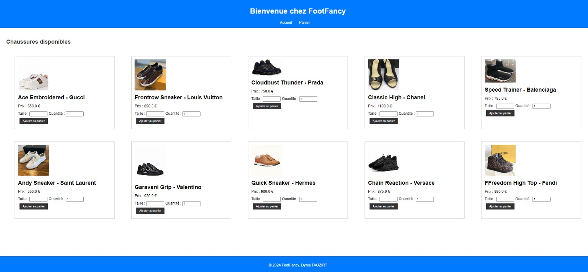
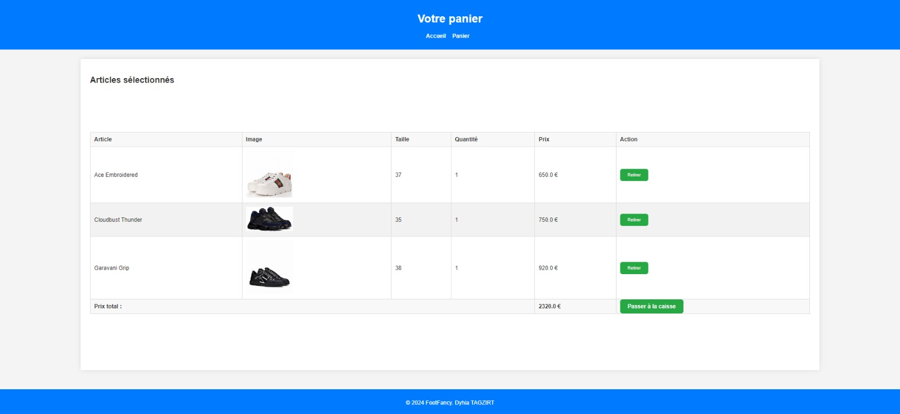
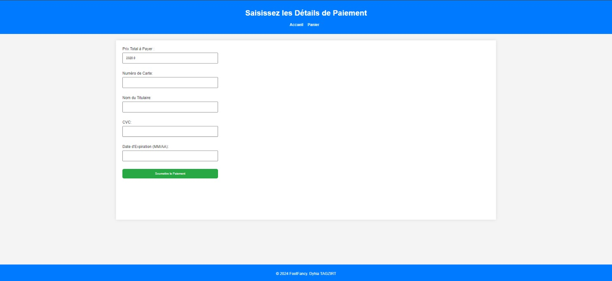
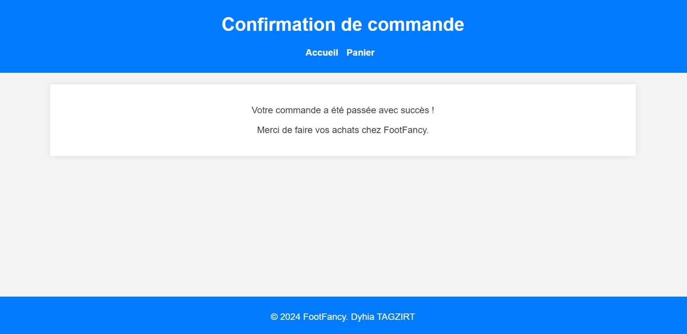

# Projet

## Étudiante

- Nom : TAGZIRT
- Prénom : Dyhia

## FootFancy

FootFancy est une application de vente de chaussures très simplifiée, elle permet à un utilisateur d'ajouter des chaussures dans un panier, de valider le panier en payant en fournissant les différentes informations de sa carte bancaire.

Cette application réalisée en JEE utilise cinq servlets qui permettent de récupérer les chaussures de la base de données, d'ajouter une chaussure dans le panier, de supprimer une chaussure du panier, d'afficher correctement les articles du panier et une pour accéder à la page de paiement.

La fonctionnalité de paiement n'est pas implémentée, elle nécessite l'utilisation d'une API externe de paiement en ligne.

## Base de données

L'application utilise une seule table `shoes` qui a comme champs : la marque, le nom de la chaussure, le lien vers l'image de la chaussure, la pointure maximale, la pointure minimale et son prix.

Les différentes images sont stockées dans le système de fichiers de l'application dans le dossier `src/webapp/images` et les différents droits d'accès au système de fichiers sont mis dans le fichier `web.xml`.

- Les requêtes utilisées pour créer la base de données :

```sql
SET SQL_MODE = "NO_AUTO_VALUE_ON_ZERO";
START TRANSACTION;
SET time_zone = "+00:00";

DROP TABLE IF EXISTS shoes;
CREATE TABLE IF NOT EXISTS shoes (
  id varchar(100) NOT NULL,
  brand varchar(255) NOT NULL,
  name varchar(255) NOT NULL,
  sizeMin int NOT NULL,
  sizeMax int NOT NULL,
  price decimal(10,2) NOT NULL,
  imagePath varchar(255) DEFAULT NULL,
  PRIMARY KEY (id)
) ENGINE=MyISAM DEFAULT CHARSET=utf8mb4 COLLATE=utf8mb4_0900_ai_ci;

INSERT INTO shoes (id, brand, name, sizeMin, sizeMax, price, imagePath) VALUES
('1', 'Gucci', 'Ace Embroidered', 36, 44, 650.00, 'gucci-ace-embroidered.jpeg'),
('2', 'Louis Vuitton', 'Frontrow Sneaker', 34, 39, 890.00, 'lv-frontrow-sneaker.jpg'),
('3', 'Prada', 'Cloudbust Thunder', 34, 44, 750.00, 'prada-cloudbust-thunder.jpg'),
('4', 'Chanel', 'Classic High', 37, 44, 1100.00, 'chanel-classic-high.jpg'),
('5', 'Balenciaga', 'Speed Trainer', 34, 44, 795.00, 'balenciaga-speed-trainer.jpg'),
('6', 'Saint Laurent', 'Andy Sneaker', 34, 45, 550.00, 'saint-laurent-andy-sneaker.jpg'),
('7', 'Valentino', 'Garavani Grip', 34, 44, 920.00, 'valentino-garavani-grip.jpg'),
('8', 'Hermes', 'Quick Sneaker', 39, 44, 980.00, 'hermes-quick-sneaker.jpg'),
('9', 'Versace', 'Chain Reaction', 34, 42, 875.00, 'versace-chain-reaction.jpg'),
('10', 'Fendi', 'FFreedom High Top', 34, 44, 890.00, 'fendi-ffreedom-high-top.jpg');
COMMIT;
```

## Application





